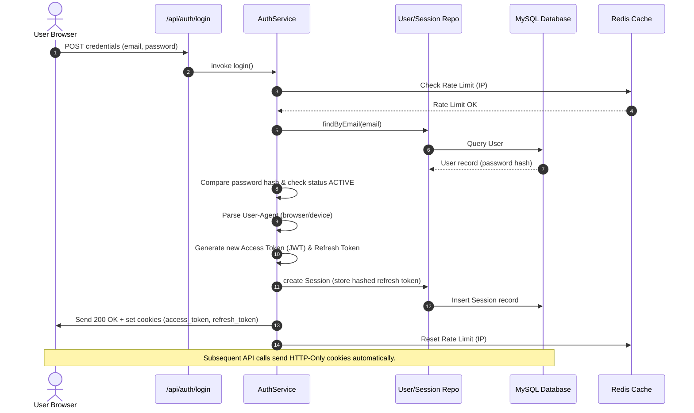
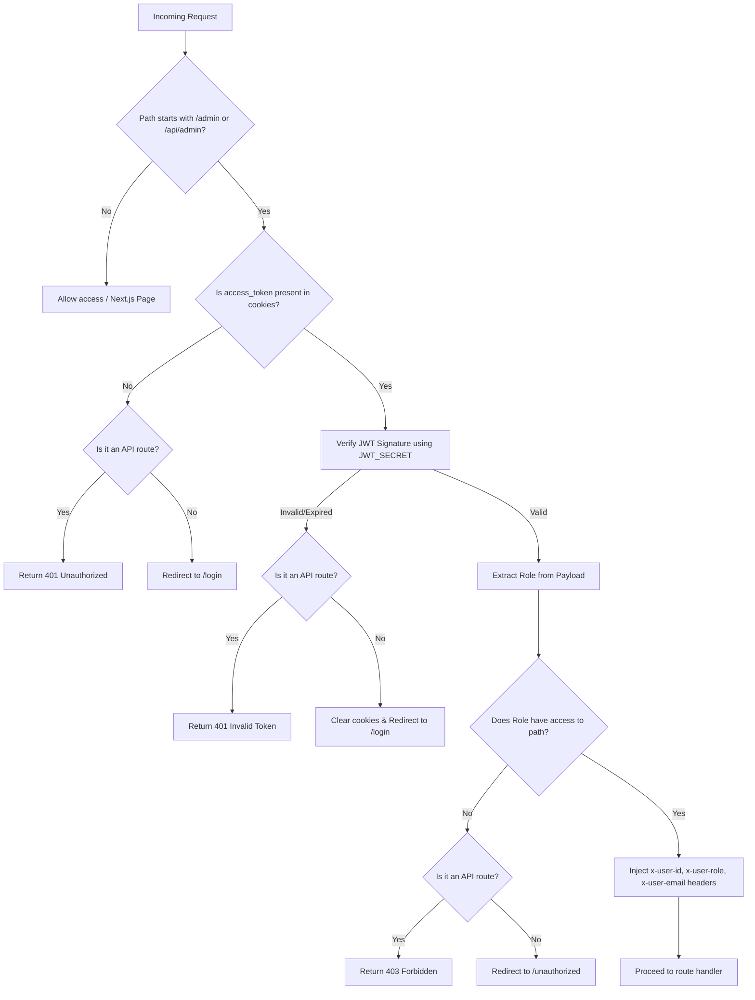

# Gujarat Post - Comprehensive Backend Analysis and Code Compilation

> [!NOTE]
> This file is a self-contained, unified source of truth for the **Gujarat Post Backend**. It provides a detailed analysis of the backend status, system flow, architecture, remaining work, and contains the **complete source code** of all backend files.

---

## 1. Executive Summary & Completeness

*   **Overall Backend Completeness:** **~35% to 40%**
*   **Authentication & Session Management:** **100% Complete**
    *   Features: Registration, Login (JWT-based), Logout, Session Rotation, Rate-Limiting, Password Reset via email.
*   **Live Data Proxy Routes:** **100% Complete**
    *   Features: Weather (Open-Meteo), Markets (Yahoo Finance), Sports (ESPN feeds), YouTube RSS Feed fallback, TV Live Status scraper.
*   **CMS / Content Backend:** **0% Complete**
    *   **CRITICAL LIMITATION:** There are currently **no database models** or CRUD APIs for news articles, categories, authors, photo galleries, video sections, ads, or e-papers.
    *   The frontend currently relies on mock/static data from `data/index.ts` to display the news content.

---

## 2. Backend Architecture & Folder Structure

The project uses Next.js (version `16.2.9`) App Router, implementing a **backend-for-frontend** architecture using standard route handlers (`app/api/.../route.ts`).

The core logic is structured in the `server/` directory using a clean **Repository-Service pattern**:

```txt
Gujarat-Post-main/
  ├── app/api/                      # Route Handlers (API controllers)
  │     ├── auth/                   # Authentication routes
  │     └── live/                   # Live data proxy routes
  ├── server/                       # Core Backend Logic
  │     ├── audit/                  # User activity logging
  │     ├── auth/                   # Cookie, token, password, rate limit helpers
  │     ├── config/                 # Environment validation and configurations
  │     ├── constants/              # Permissions and roles configuration
  │     ├── database/               # Prisma client singleton and db seed file
  │     ├── middleware/             # Express-like requireAuth & requireRole wrappers
  │     ├── repositories/           # Direct database access (User, Session)
  │     ├── services/               # Core business logic (AuthService)
  │     ├── types/                  # Backend type definitions
  │     ├── utils/                  # Helper utilities (mail, response, crypto, logger)
  │     └── validators/             # Zod validation schemas
  ├── prisma/                       # Database Configurations
  │     └── schema.prisma           # MySQL schema
  └── middleware.ts                 # Next.js global route guard middleware
```

---

## 3. Database Schema Overview (MySQL & Prisma)

The database schema is defined in `prisma/schema.prisma`. Currently, it only contains 3 tables:

1.  **User**: Handles user accounts, passwords (hashed), role definitions, and account status.
2.  **Session**: Manages user active sessions, refresh tokens (hashed using SHA-256 for rotation), client info (IP, Browser, Device, Country), and expiry.
3.  **AuditLog**: Logs user actions (e.g., login, password resets, registrations) for security monitoring.

### Role Hierarchy & Definitions
The backend supports six distinct roles:
*   `SUPER_ADMIN`: Full access to the whole admin area.
*   `EDITOR`: Permissions for articles, categories, and galleries.
*   `REPORTER`: Permission to write/edit their own articles.
*   `SEO`: Permission to manage SEO metadata and configurations.
*   `ADVERTISEMENT`: Permission to manage advertisements.
*   `PHOTOGRAPHER`: Permission to manage image galleries.

---

## 4. Backend Flows & Diagrams

### A. Authentication & Session Flow
The backend uses **Access Tokens (stored in memory / short-lived cookie)** and **Refresh Tokens (stored in HTTP-Only cookies, with rotation)**:



### B. Route Guard & Path Authorization Flow
Next.js global `middleware.ts` intercepts all requests to `/admin` and `/api/admin`:



---

## 5. Remaining / Missing Backend Work (Gaps to 100%)

To make the backend fully functional for a production news portal, the following items must be implemented:

1.  **Content Database Models (Prisma):**
    *   `Article`: fields for title, slug, content, contentHtml, mainImage, views, breaking, featured, trending, categoryId, authorId, status (draft/published), seo fields, tags.
    *   `Category`: fields for name, slug, description, active.
    *   `Author` / `Profile`: biography, profile image, socials.
    *   `Epaper`: title, publicationDate, pdfUrl, thumbnail.
    *   `Advertisement`: title, bannerUrl, targetUrl, slotName, active, startDate, endDate.
    *   `Media`: file name, url, fileType, size, uploadedById.
2.  **CMS CRUD API Route Handlers (`/api/admin/.../`):**
    *   Create, Read, Update, Delete routes for articles, categories, authors, ads, epaper.
    *   Protect these route handlers using the `requirePermission` or `requireRole` helpers.
3.  **Media Upload Service:**
    *   Integrate an object storage client (like AWS S3 or Cloudflare R2) or write local file upload handlers to manage images for articles, galleries, and ads.
4.  **Admin UI Data Integration:**
    *   Implement data-fetching in the admin panels using React/Next.js client-side queries (fetching from `/api/admin/.../route.ts`).
5.  **Migrate Public Frontend pages from Static Data:**
    *   Replace imports of `data/index.ts` inside client pages with actual database fetching, either via server component queries or public API routes like `/api/news/...`.

---

## 6. Complete Source Code Compilation

Below is the complete source code of all backend files, sorted logically from database configuration to services and API routes.


### [prisma/schema.prisma](file:///d:/Htech/GujaratPost/Gujarat-Post-main/prisma/schema.prisma)

```prisma
datasource db {
  provider = "mysql"
  url      = env("DATABASE_URL")
}

generator client {
  provider = "prisma-client-js"
}

enum Role {
  SUPER_ADMIN
  EDITOR
  REPORTER
  SEO
  ADVERTISEMENT
  PHOTOGRAPHER
}

enum AccountStatus {
  ACTIVE
  SUSPENDED
  DELETED
  PENDING_VERIFICATION
}

model User {
  id             String          @id @default(uuid())
  email          String          @unique
  passwordHash   String
  role           Role            @default(REPORTER)
  status         AccountStatus   @default(PENDING_VERIFICATION)
  createdAt      DateTime        @default(now())
  updatedAt      DateTime        @updatedAt
  sessions       Session[]
  auditLogs      AuditLog[]
}

model Session {
  id           String    @id @default(uuid())
  userId       String
  user         User      @relation(fields: [userId], references: [id], onDelete: Cascade)
  tokenHash    String    @unique @db.VarChar(255) // SHA-256 hash of the 256-bit random refresh token
  deviceName   String?   @db.VarChar(255)
  browser      String?   @db.VarChar(255)
  ipAddress    String?   @db.VarChar(45)
  country      String?   @db.VarChar(100)
  createdAt    DateTime  @default(now())
  lastUsedAt   DateTime  @default(now())
  expiresAt    DateTime
  revokedAt    DateTime?
}

model AuditLog {
  id        String   @id @default(uuid())
  userId    String?
  user      User?    @relation(fields: [userId], references: [id], onDelete: SetNull)
  action    String   @db.VarChar(255) // e.g., "LOGIN_SUCCESS", "PASSWORD_CHANGE"
  ipAddress String?  @db.VarChar(45)
  userAgent String?  @db.VarChar(255)
  createdAt DateTime @default(now())
}

```

---

### [middleware.ts](file:///d:/Htech/GujaratPost/Gujarat-Post-main/middleware.ts)

```typescript
import { NextResponse } from "next/server";
import type { NextRequest } from "next/server";
import { jwtVerify } from "jose";

const JWT_SECRET = new TextEncoder().encode(
  process.env.JWT_SECRET || "fallback-super-secret-key-at-least-32-characters-long"
);

interface TokenPayload {
  userId: string;
  email: string;
  role: string;
}

// Map roles to their permitted admin path prefixes
const ROLE_PERMISSIONS: Record<string, string[]> = {
  SUPER_ADMIN: ["/admin"], // Super admin can access all admin routes
  EDITOR: ["/admin/articles", "/admin/categories", "/admin/gallery"],
  REPORTER: ["/admin/articles"],
  SEO: ["/admin/seo"],
  ADVERTISEMENT: ["/admin/ads"],
  PHOTOGRAPHER: ["/admin/gallery"],
};

export async function middleware(request: NextRequest) {
  const { pathname } = request.nextUrl;

  // Only run middleware on /admin routes and /api/admin routes
  if (!pathname.startsWith("/admin") && !pathname.startsWith("/api/admin")) {
    return NextResponse.next();
  }

  const token = request.cookies.get("access_token")?.value;

  // If token is missing, redirect to login (or return 401 for API routes)
  if (!token) {
    if (pathname.startsWith("/api/")) {
      return NextResponse.json({ error: "Authentication token missing" }, { status: 401 });
    }
    const loginUrl = new URL("/login", request.url);
    loginUrl.searchParams.set("from", pathname);
    return NextResponse.redirect(loginUrl);
  }

  try {
    // Verify JWT
    const { payload } = await jwtVerify(token, JWT_SECRET);
    const userPayload = payload as unknown as TokenPayload;

    const userRole = userPayload.role;

    // Check permissions
    if (userRole === "SUPER_ADMIN") {
      return NextResponse.next();
    }

    const permittedPaths = ROLE_PERMISSIONS[userRole] || [];
    
    // Check if the current pathname is allowed or matches a permitted prefix
    const isPermitted = permittedPaths.some(
      (path) => pathname === path || pathname.startsWith(path + "/")
    );

    if (!isPermitted) {
      if (pathname.startsWith("/api/")) {
        return NextResponse.json({ error: "Forbidden: Insufficient permissions" }, { status: 403 });
      }
      return NextResponse.redirect(new URL("/unauthorized", request.url));
    }

    // Set custom headers to propagate user metadata to downstream routes
    const requestHeaders = new Headers(request.headers);
    requestHeaders.set("x-user-id", userPayload.userId);
    requestHeaders.set("x-user-email", userPayload.email);
    requestHeaders.set("x-user-role", userPayload.role);

    return NextResponse.next({
      request: {
        headers: requestHeaders,
      },
    });

  } catch (error) {
    console.error("Middleware JWT verification failed:", error);
    
    if (pathname.startsWith("/api/")) {
      return NextResponse.json({ error: "Invalid or expired token" }, { status: 401 });
    }

    const loginUrl = new URL("/login", request.url);
    loginUrl.searchParams.set("from", pathname);
    const response = NextResponse.redirect(loginUrl);
    response.cookies.delete("access_token");
    return response;
  }
}

export const config = {
  matcher: ["/admin/:path*", "/api/admin/:path*"],
};

```

---

### [server/config/env.ts](file:///d:/Htech/GujaratPost/Gujarat-Post-main/server/config/env.ts)

```typescript
import { z } from "zod";

const EnvSchema = z.object({
  // Database
  DATABASE_URL: z.string().min(1, "DATABASE_URL is required"),

  // JWT
  JWT_SECRET: z
    .string()
    .min(32, "JWT_SECRET must be at least 32 characters"),

  // Redis
  REDIS_URL: z.string().default("redis://localhost:6379"),

  // Resend (Email)
  RESEND_API_KEY: z.string().default(""),
  RESEND_FROM_EMAIL: z.string().default("noreply@gujaratpost.com"),
  RESEND_FROM_NAME: z.string().default("Gujarat Post"),

  // App
  NEXT_PUBLIC_APP_URL: z.string().default("http://localhost:3000"),
  NODE_ENV: z
    .enum(["development", "production", "test"])
    .default("development"),
});

// Parse once at module load — throws immediately if required vars are missing
const _env = EnvSchema.safeParse(process.env);

if (!_env.success) {
  console.error(
    "❌  Invalid environment variables:\n",
    _env.error.flatten().fieldErrors
  );
  throw new Error("Invalid environment configuration. Check your .env file.");
}

export const env = _env.data;
export type Env = typeof env;

```

---

### [server/config/auth.ts](file:///d:/Htech/GujaratPost/Gujarat-Post-main/server/config/auth.ts)

```typescript
// ---------------------------------------------------------------------------
// Authentication Configuration Constants
// ---------------------------------------------------------------------------

export const AUTH_CONFIG = {
  // Access token lifetime (used both for JWT expiry and maxAge cookie)
  ACCESS_TOKEN_EXPIRY: "15m",
  ACCESS_TOKEN_MAX_AGE_SECONDS: 15 * 60, // 15 minutes

  // Refresh token lifetime
  REFRESH_TOKEN_EXPIRY_DAYS: 7,
  REFRESH_TOKEN_MAX_AGE_SECONDS: 7 * 24 * 60 * 60, // 7 days

  // Cookie names
  COOKIE_ACCESS_TOKEN: "access_token",
  COOKIE_REFRESH_TOKEN: "refresh_token",

  // Rate limiting (Redis-backed)
  RATE_LIMIT_MAX_ATTEMPTS: 5,
  RATE_LIMIT_WINDOW_SECONDS: 15 * 60, // 15 minutes

  // Password reset token lifetime
  PASSWORD_RESET_EXPIRY_MINUTES: 60, // 1 hour

  // Email verification token lifetime
  EMAIL_VERIFY_EXPIRY_HOURS: 24, // 24 hours

  // Bcrypt salt rounds
  BCRYPT_ROUNDS: 10,
} as const;

```

---

### [server/config/database.ts](file:///d:/Htech/GujaratPost/Gujarat-Post-main/server/config/database.ts)

```typescript
import { env } from "./env";

export const DATABASE_CONFIG = {
  url: env.DATABASE_URL,
  // Log levels per environment
  logLevels:
    env.NODE_ENV === "development"
      ? (["query", "error", "warn"] as const)
      : (["error"] as const),
} as const;

```

---

### [server/constants/roles.ts](file:///d:/Htech/GujaratPost/Gujarat-Post-main/server/constants/roles.ts)

```typescript
export const ROLES = {
  SUPER_ADMIN: "SUPER_ADMIN",
  EDITOR: "EDITOR",
  REPORTER: "REPORTER",
  SEO: "SEO",
  ADVERTISEMENT: "ADVERTISEMENT",
  PHOTOGRAPHER: "PHOTOGRAPHER",
} as const;

export type Role = (typeof ROLES)[keyof typeof ROLES];

/** Ordered from most privileged to least privileged. */
export const ROLE_HIERARCHY: Role[] = [
  ROLES.SUPER_ADMIN,
  ROLES.EDITOR,
  ROLES.REPORTER,
  ROLES.SEO,
  ROLES.ADVERTISEMENT,
  ROLES.PHOTOGRAPHER,
];

```

---

### [server/constants/permissions.ts](file:///d:/Htech/GujaratPost/Gujarat-Post-main/server/constants/permissions.ts)

```typescript
import type { Role } from "./roles";

// ---------------------------------------------------------------------------
// Granular permission actions
// ---------------------------------------------------------------------------
export type Permission =
  | "*"                     // Wildcard — all permissions
  | "articles:create"
  | "articles:edit"
  | "articles:delete"
  | "articles:publish"
  | "articles:read"
  | "categories:manage"
  | "gallery:upload"
  | "gallery:delete"
  | "gallery:read"
  | "users:read"
  | "users:create"
  | "users:edit"
  | "users:delete"
  | "ads:manage"
  | "seo:manage"
  | "settings:manage"
  | "logs:read"
  | "roles:manage";

// ---------------------------------------------------------------------------
// Role → Permissions Map
// ---------------------------------------------------------------------------
export const PERMISSIONS: Record<Role, Permission[]> = {
  SUPER_ADMIN: ["*"],

  EDITOR: [
    "articles:create",
    "articles:edit",
    "articles:delete",
    "articles:publish",
    "articles:read",
    "categories:manage",
    "gallery:upload",
    "gallery:delete",
    "gallery:read",
  ],

  REPORTER: [
    "articles:create",
    "articles:edit",
    "articles:read",
    "gallery:read",
  ],

  SEO: [
    "seo:manage",
    "articles:read",
  ],

  ADVERTISEMENT: [
    "ads:manage",
  ],

  PHOTOGRAPHER: [
    "gallery:upload",
    "gallery:read",
  ],
};

```

---

### [server/types/auth.ts](file:///d:/Htech/GujaratPost/Gujarat-Post-main/server/types/auth.ts)

```typescript
import type { Role } from "@/server/constants/roles";

// ---------------------------------------------------------------------------
// JWT Token Payload (embedded in the JWT)
// ---------------------------------------------------------------------------
export interface TokenPayload {
  userId: string;
  email: string;
  role: Role;
}

// ---------------------------------------------------------------------------
// Session input (used when creating a session record)
// ---------------------------------------------------------------------------
export interface SessionCreateInput {
  userId: string;
  deviceName?: string;
  browser?: string;
  ipAddress?: string;
  country?: string;
}

// ---------------------------------------------------------------------------
// Login result returned from AuthService
// ---------------------------------------------------------------------------
export interface LoginResult {
  accessToken: string;
  refreshToken: string;
  user: {
    id: string;
    email: string;
    role: Role;
  };
}

// ---------------------------------------------------------------------------
// Auth service method inputs
// ---------------------------------------------------------------------------
export interface LoginInput {
  email: string;
  password: string;
  rememberMe?: boolean;
}

export interface RegisterInput {
  email: string;
  password: string;
  role?: Role;
}

export interface ForgotPasswordInput {
  email: string;
}

export interface ResetPasswordInput {
  token: string;
  password: string;
}

export interface VerifyEmailInput {
  token: string;
}

export interface ChangePasswordInput {
  userId: string;
  currentPassword: string;
  newPassword: string;
}

```

---

### [server/types/article.ts](file:///d:/Htech/GujaratPost/Gujarat-Post-main/server/types/article.ts)

```typescript
// ---------------------------------------------------------------------------
// Article DTOs (Data Transfer Objects)
// ---------------------------------------------------------------------------

export interface ArticleCreateDTO {
  title: string;
  titleGu?: string;
  titleHi?: string;
  slug: string;
  excerpt: string;
  content: string;
  image?: string;
  category: string;
  tags?: string[];
  authorId: string;
  isFeatured?: boolean;
  isBreaking?: boolean;
}

export interface ArticleUpdateDTO extends Partial<ArticleCreateDTO> {
  id: string;
}

export interface ArticlePublishDTO {
  id: string;
  publishedAt?: Date;
}

```

---

### [server/validators/auth.validator.ts](file:///d:/Htech/GujaratPost/Gujarat-Post-main/server/validators/auth.validator.ts)

```typescript
import { z } from "zod";

// ---------------------------------------------------------------------------
// Register
// ---------------------------------------------------------------------------
export const RegisterSchema = z.object({
  email: z.string().email("Invalid email format"),
  password: z
    .string()
    .min(8, "Password must be at least 8 characters")
    .regex(/[A-Z]/, "Password must contain at least one uppercase letter")
    .regex(/[0-9]/, "Password must contain at least one number"),
  role: z
    .enum([
      "SUPER_ADMIN",
      "EDITOR",
      "REPORTER",
      "SEO",
      "ADVERTISEMENT",
      "PHOTOGRAPHER",
    ])
    .optional(),
});

export type RegisterSchema = z.infer<typeof RegisterSchema>;

// ---------------------------------------------------------------------------
// Login
// ---------------------------------------------------------------------------
export const LoginSchema = z.object({
  email: z.string().email("Invalid email format"),
  password: z.string().min(1, "Password is required"),
  rememberMe: z.boolean().optional().default(true),
});

export type LoginSchema = z.infer<typeof LoginSchema>;

// ---------------------------------------------------------------------------
// Forgot Password
// ---------------------------------------------------------------------------
export const ForgotPasswordSchema = z.object({
  email: z.string().email("Invalid email format"),
});

// ---------------------------------------------------------------------------
// Reset Password
// ---------------------------------------------------------------------------
export const ResetPasswordSchema = z.object({
  token: z.string().min(1, "Reset token is required"),
  password: z
    .string()
    .min(8, "Password must be at least 8 characters")
    .regex(/[A-Z]/, "Must contain an uppercase letter")
    .regex(/[0-9]/, "Must contain a number"),
});

// ---------------------------------------------------------------------------
// Verify Email
// ---------------------------------------------------------------------------
export const VerifyEmailSchema = z.object({
  token: z.string().min(1, "Verification token is required"),
});

// ---------------------------------------------------------------------------
// Change Password
// ---------------------------------------------------------------------------
export const ChangePasswordSchema = z.object({
  currentPassword: z.string().min(1, "Current password is required"),
  newPassword: z
    .string()
    .min(8, "New password must be at least 8 characters")
    .regex(/[A-Z]/, "Must contain an uppercase letter")
    .regex(/[0-9]/, "Must contain a number"),
});

```

---

### [server/utils/crypto.ts](file:///d:/Htech/GujaratPost/Gujarat-Post-main/server/utils/crypto.ts)

```typescript
import crypto from "crypto";

/** Generate a URL-safe random token string. */
export function generateSecureToken(bytes = 32): string {
  return crypto.randomBytes(bytes).toString("hex");
}

/** Hash any string with SHA-256, returns a hex digest. */
export function sha256(input: string): string {
  return crypto.createHash("sha256").update(input).digest("hex");
}

/** Generate a numeric OTP of the specified length. */
export function generateOTP(digits = 6): string {
  const max = Math.pow(10, digits);
  return String(crypto.randomInt(0, max)).padStart(digits, "0");
}

/** Constant-time string comparison to prevent timing attacks. */
export function safeCompare(a: string, b: string): boolean {
  if (a.length !== b.length) return false;
  return crypto.timingSafeEqual(Buffer.from(a), Buffer.from(b));
}

```

---

### [server/utils/errors.ts](file:///d:/Htech/GujaratPost/Gujarat-Post-main/server/utils/errors.ts)

```typescript
// ---------------------------------------------------------------------------
// Custom Application Errors
// ---------------------------------------------------------------------------

export class AppError extends Error {
  public readonly statusCode: number;
  public readonly code: string;
  public readonly isOperational: boolean;

  constructor(
    message: string,
    statusCode = 500,
    code = "INTERNAL_ERROR",
    isOperational = true
  ) {
    super(message);
    this.name = this.constructor.name;
    this.statusCode = statusCode;
    this.code = code;
    this.isOperational = isOperational;
    Error.captureStackTrace(this, this.constructor);
  }
}

export class ValidationError extends AppError {
  public readonly details: unknown;
  constructor(message: string, details?: unknown) {
    super(message, 400, "VALIDATION_ERROR");
    this.details = details;
  }
}

export class UnauthorizedError extends AppError {
  constructor(message = "Authentication required") {
    super(message, 401, "UNAUTHORIZED");
  }
}

export class ForbiddenError extends AppError {
  constructor(message = "You do not have permission to perform this action") {
    super(message, 403, "FORBIDDEN");
  }
}

export class NotFoundError extends AppError {
  constructor(resource = "Resource") {
    super(`${resource} not found`, 404, "NOT_FOUND");
  }
}

export class ConflictError extends AppError {
  constructor(message = "A conflict occurred") {
    super(message, 409, "CONFLICT");
  }
}

export class TooManyRequestsError extends AppError {
  public readonly retryAfter: number;
  constructor(retryAfterSeconds: number) {
    super(
      `Too many requests. Try again in ${retryAfterSeconds} seconds.`,
      429,
      "TOO_MANY_REQUESTS"
    );
    this.retryAfter = retryAfterSeconds;
  }
}

```

---

### [server/utils/logger.ts](file:///d:/Htech/GujaratPost/Gujarat-Post-main/server/utils/logger.ts)

```typescript
import { env } from "@/server/config/env";

type LogLevel = "debug" | "info" | "warn" | "error";

const LEVEL_COLORS: Record<LogLevel, string> = {
  debug: "\x1b[36m", // cyan
  info: "\x1b[32m",  // green
  warn: "\x1b[33m",  // yellow
  error: "\x1b[31m", // red
};
const RESET = "\x1b[0m";

function log(level: LogLevel, message: string, meta?: unknown): void {
  const isDev = env.NODE_ENV === "development";
  const timestamp = new Date().toISOString();
  const color = LEVEL_COLORS[level];
  const prefix = isDev
    ? `${color}[${level.toUpperCase()}]${RESET} ${timestamp}`
    : JSON.stringify({ level, timestamp, message, ...(meta ? { meta } : {}) });

  if (isDev) {
    const metaStr = meta ? ` ${JSON.stringify(meta)}` : "";
    console.log(`${prefix} — ${message}${metaStr}`);
  } else {
    console.log(prefix);
  }
}

export const logger = {
  debug: (msg: string, meta?: unknown) => log("debug", msg, meta),
  info: (msg: string, meta?: unknown) => log("info", msg, meta),
  warn: (msg: string, meta?: unknown) => log("warn", msg, meta),
  error: (msg: string, meta?: unknown) => log("error", msg, meta),
};

```

---

### [server/utils/mail.ts](file:///d:/Htech/GujaratPost/Gujarat-Post-main/server/utils/mail.ts)

```typescript
import { Resend } from "resend";
import { env } from "@/server/config/env";
import { logger } from "./logger";

// ---------------------------------------------------------------------------
// Provider-agnostic MailService interface
// ---------------------------------------------------------------------------
export interface SendEmailOptions {
  to: string | string[];
  subject: string;
  html: string;
  from?: string;
}

export interface MailService {
  send(options: SendEmailOptions): Promise<{ id?: string }>;
}

// ---------------------------------------------------------------------------
// Resend implementation
// ---------------------------------------------------------------------------
class ResendMailService implements MailService {
  private client: Resend;
  private fromAddress: string;

  constructor() {
    this.client = new Resend(env.RESEND_API_KEY);
    this.fromAddress = `${env.RESEND_FROM_NAME} <${env.RESEND_FROM_EMAIL}>`;
  }

  async send(options: SendEmailOptions): Promise<{ id?: string }> {
    try {
      const { data, error } = await this.client.emails.send({
        from: options.from ?? this.fromAddress,
        to: Array.isArray(options.to) ? options.to : [options.to],
        subject: options.subject,
        html: options.html,
      });

      if (error) {
        logger.error("[mail] Resend error", error);
        return {};
      }

      logger.info("[mail] Email sent", { id: data?.id, to: options.to });
      return { id: data?.id };
    } catch (err) {
      logger.error("[mail] Unexpected error", err);
      return {};
    }
  }
}

// Singleton mail service — swap implementation here (e.g. SendGrid, Nodemailer)
export const mail: MailService = new ResendMailService();

// ---------------------------------------------------------------------------
// Templated helpers
// ---------------------------------------------------------------------------
const appUrl = env.NEXT_PUBLIC_APP_URL;

export async function sendPasswordResetEmail(
  to: string,
  token: string
): Promise<void> {
  const link = `${appUrl}/reset-password?token=${token}`;
  await mail.send({
    to,
    subject: "Reset Your Gujarat Post Password",
    html: `
      <h2>Password Reset Request</h2>
      <p>Click the link below to reset your password. This link expires in 1 hour.</p>
      <a href="${link}" style="background:#c0392b;color:#fff;padding:12px 24px;border-radius:6px;text-decoration:none;display:inline-block;">Reset Password</a>
      <p>If you did not request this, ignore this email.</p>
    `,
  });
}

export async function sendEmailVerificationEmail(
  to: string,
  token: string
): Promise<void> {
  const link = `${appUrl}/verify-email?token=${token}`;
  await mail.send({
    to,
    subject: "Verify Your Gujarat Post Email",
    html: `
      <h2>Verify Your Email Address</h2>
      <p>Click the link below to verify your email. This link expires in 24 hours.</p>
      <a href="${link}" style="background:#c0392b;color:#fff;padding:12px 24px;border-radius:6px;text-decoration:none;display:inline-block;">Verify Email</a>
    `,
  });
}

export async function sendLoginNotificationEmail(
  to: string,
  device: string,
  ip: string
): Promise<void> {
  await mail.send({
    to,
    subject: "New Login Detected — Gujarat Post",
    html: `
      <h2>New Login to Your Account</h2>
      <p>A new login was detected on your Gujarat Post account.</p>
      <ul>
        <li><strong>Device:</strong> ${device}</li>
        <li><strong>IP Address:</strong> ${ip}</li>
        <li><strong>Time:</strong> ${new Date().toISOString()}</li>
      </ul>
      <p>If this was not you, please change your password immediately.</p>
    `,
  });
}

```

---

### [server/utils/response.ts](file:///d:/Htech/GujaratPost/Gujarat-Post-main/server/utils/response.ts)

```typescript
import { NextResponse } from "next/server";
import { AppError, TooManyRequestsError } from "./errors";

// ---------------------------------------------------------------------------
// Success
// ---------------------------------------------------------------------------
export function ApiSuccess<T>(
  data: T,
  message = "Success",
  status = 200
): NextResponse {
  return NextResponse.json({ success: true, message, data }, { status });
}

// ---------------------------------------------------------------------------
// Created
// ---------------------------------------------------------------------------
export function ApiCreated<T>(data: T, message = "Created"): NextResponse {
  return ApiSuccess(data, message, 201);
}

// ---------------------------------------------------------------------------
// Error
// ---------------------------------------------------------------------------
export function ApiError(
  error: unknown,
  defaultMessage = "An unexpected error occurred"
): NextResponse {
  if (error instanceof TooManyRequestsError) {
    return NextResponse.json(
      { success: false, code: error.code, message: error.message },
      {
        status: 429,
        headers: { "Retry-After": String(error.retryAfter) },
      }
    );
  }

  if (error instanceof AppError) {
    return NextResponse.json(
      {
        success: false,
        code: error.code,
        message: error.message,
        ...(((error as unknown as { details?: unknown }).details !== undefined) && {
          details: (error as unknown as { details: unknown }).details,
        }),
      },
      { status: error.statusCode }
    );
  }

  console.error("[ApiError] Unhandled:", error);
  return NextResponse.json(
    { success: false, code: "INTERNAL_ERROR", message: defaultMessage },
    { status: 500 }
  );
}

// ---------------------------------------------------------------------------
// Paginated
// ---------------------------------------------------------------------------
export function ApiPaginated<T>(
  items: T[],
  total: number,
  page: number,
  pageSize: number
): NextResponse {
  return NextResponse.json({
    success: true,
    data: items,
    pagination: {
      total,
      page,
      pageSize,
      totalPages: Math.ceil(total / pageSize),
    },
  });
}

```

---

### [server/database/prisma.ts](file:///d:/Htech/GujaratPost/Gujarat-Post-main/server/database/prisma.ts)

```typescript
import { PrismaClient } from "@prisma/client";
import { DATABASE_CONFIG } from "@/server/config/database";

const globalForPrisma = globalThis as unknown as {
  prisma: PrismaClient | undefined;
};

export const prisma =
  globalForPrisma.prisma ??
  new PrismaClient({
    log: DATABASE_CONFIG.logLevels as unknown as ("query" | "error" | "warn" | "info")[],
  });

if (process.env.NODE_ENV !== "production") globalForPrisma.prisma = prisma;

```

---

### [server/database/seed.ts](file:///d:/Htech/GujaratPost/Gujarat-Post-main/server/database/seed.ts)

```typescript
/**
 * Database Seeder — creates the initial SUPER_ADMIN account.
 * Run with:  npx ts-node server/database/seed.ts
 * or:        node -r ts-node/register server/database/seed.ts
 */

import bcrypt from "bcryptjs";
import { prisma } from "./prisma";
import { AUTH_CONFIG } from "@/server/config/auth";

async function main() {
  const email = process.env.SEED_ADMIN_EMAIL ?? "admin@gujaratpost.com";
  const password = process.env.SEED_ADMIN_PASSWORD ?? "Admin@123456";

  const existing = await prisma.user.findUnique({ where: { email } });
  if (existing) {
    console.log(`ℹ️  Admin user already exists: ${email}`);
    return;
  }

  const passwordHash = await bcrypt.hash(password, AUTH_CONFIG.BCRYPT_ROUNDS);

  const admin = await prisma.user.create({
    data: {
      email,
      passwordHash,
      role: "SUPER_ADMIN",
      status: "ACTIVE",
    },
  });

  console.log(`✅  SUPER_ADMIN created: ${admin.email} (id: ${admin.id})`);
  console.log(`⚠️  Change the default password immediately after first login.`);
}

main()
  .catch((err) => {
    console.error("❌  Seed failed:", err);
    process.exit(1);
  })
  .finally(async () => {
    await prisma.$disconnect();
  });

```

---

### [server/audit/audit.service.ts](file:///d:/Htech/GujaratPost/Gujarat-Post-main/server/audit/audit.service.ts)

```typescript
import { prisma } from "@/server/database/prisma";
import { logger } from "@/server/utils/logger";

// ---------------------------------------------------------------------------
// Audit Event Types
// ---------------------------------------------------------------------------
export type AuditAction =
  | "USER_REGISTERED"
  | "LOGIN_SUCCESS"
  | "LOGIN_FAILED"
  | "LOGOUT_SUCCESS"
  | "TOKEN_REFRESHED"
  | "PASSWORD_CHANGED"
  | "PASSWORD_RESET_REQUESTED"
  | "PASSWORD_RESET_SUCCESS"
  | "EMAIL_VERIFIED"
  | "SESSION_REVOKED"
  | "ACCOUNT_SUSPENDED"
  | "ACCOUNT_DELETED"
  | "ROLE_CHANGED"
  | "ARTICLE_CREATED"
  | "ARTICLE_PUBLISHED"
  | "ARTICLE_DELETED";

// ---------------------------------------------------------------------------
// Audit Service
// ---------------------------------------------------------------------------
export const AuditService = {
  async logEvent(
    action: AuditAction,
    options: {
      userId?: string;
      ipAddress?: string;
      userAgent?: string;
    } = {}
  ): Promise<void> {
    try {
      await prisma.auditLog.create({
        data: {
          action,
          userId: options.userId,
          ipAddress: options.ipAddress,
          userAgent: options.userAgent,
        },
      });
    } catch (err) {
      // Never let audit logging break the main flow
      logger.error("[AuditService] Failed to write audit log", {
        action,
        err,
      });
    }
  },
};

```

---

### [server/auth/cookies.ts](file:///d:/Htech/GujaratPost/Gujarat-Post-main/server/auth/cookies.ts)

```typescript
import { cookies } from "next/headers";
import { env } from "@/server/config/env";
import { AUTH_CONFIG } from "@/server/config/auth";

const isProduction = env.NODE_ENV === "production";

/** Set both access_token and refresh_token as HTTP-only cookies. */
export async function setAuthCookies(
  accessToken: string,
  refreshToken: string,
  rememberMe = true
): Promise<void> {
  const jar = await cookies();

  jar.set(AUTH_CONFIG.COOKIE_ACCESS_TOKEN, accessToken, {
    httpOnly: true,
    secure: isProduction,
    sameSite: "lax",
    path: "/",
    maxAge: AUTH_CONFIG.ACCESS_TOKEN_MAX_AGE_SECONDS,
  });

  jar.set(AUTH_CONFIG.COOKIE_REFRESH_TOKEN, refreshToken, {
    httpOnly: true,
    secure: isProduction,
    sameSite: "lax",
    path: "/",
    ...(rememberMe
      ? { maxAge: AUTH_CONFIG.REFRESH_TOKEN_MAX_AGE_SECONDS }
      : {}),
  });
}

/** Delete both auth cookies from the client. */
export async function clearAuthCookies(): Promise<void> {
  const jar = await cookies();
  jar.set(AUTH_CONFIG.COOKIE_ACCESS_TOKEN, "", { maxAge: 0, path: "/" });
  jar.set(AUTH_CONFIG.COOKIE_REFRESH_TOKEN, "", { maxAge: 0, path: "/" });
}

/** Read the raw access token string from cookies. */
export async function getAccessTokenCookie(): Promise<string | undefined> {
  const jar = await cookies();
  return jar.get(AUTH_CONFIG.COOKIE_ACCESS_TOKEN)?.value;
}

/** Read the raw refresh token string from cookies. */
export async function getRefreshTokenCookie(): Promise<string | undefined> {
  const jar = await cookies();
  return jar.get(AUTH_CONFIG.COOKIE_REFRESH_TOKEN)?.value;
}

```

---

### [server/auth/jwt.ts](file:///d:/Htech/GujaratPost/Gujarat-Post-main/server/auth/jwt.ts)

```typescript
import { SignJWT, jwtVerify } from "jose";
import { env } from "@/server/config/env";
import { AUTH_CONFIG } from "@/server/config/auth";
import type { TokenPayload } from "@/server/types/auth";

const secret = new TextEncoder().encode(env.JWT_SECRET);

/** Sign a 15-minute access token. */
export async function signAccessToken(payload: TokenPayload): Promise<string> {
  return new SignJWT({ ...payload })
    .setProtectedHeader({ alg: "HS256" })
    .setIssuedAt()
    .setExpirationTime(AUTH_CONFIG.ACCESS_TOKEN_EXPIRY)
    .sign(secret);
}

/** Verify and decode an access token. Returns null on any failure. */
export async function verifyAccessToken(
  token: string
): Promise<TokenPayload | null> {
  try {
    const { payload } = await jwtVerify(token, secret);
    return payload as unknown as TokenPayload;
  } catch {
    return null;
  }
}

```

---

### [server/auth/password.ts](file:///d:/Htech/GujaratPost/Gujarat-Post-main/server/auth/password.ts)

```typescript
import bcrypt from "bcryptjs";
import { AUTH_CONFIG } from "@/server/config/auth";

/** Hash a plain-text password with bcrypt. */
export async function hashPassword(plainText: string): Promise<string> {
  return bcrypt.hash(plainText, AUTH_CONFIG.BCRYPT_ROUNDS);
}

/** Compare a plain-text password against a stored bcrypt hash. */
export async function comparePassword(
  plainText: string,
  hash: string
): Promise<boolean> {
  return bcrypt.compare(plainText, hash);
}

```

---

### [server/auth/permissions.ts](file:///d:/Htech/GujaratPost/Gujarat-Post-main/server/auth/permissions.ts)

```typescript
import { ROLES, type Role } from "@/server/constants/roles";
import { PERMISSIONS, type Permission } from "@/server/constants/permissions";

/**
 * Returns true if the given role has permission to perform the action.
 */
export function hasPermission(role: Role, permission: Permission): boolean {
  const allowed = PERMISSIONS[role] ?? [];
  return allowed.includes("*") || allowed.includes(permission);
}

/**
 * Returns true if roleA is hierarchically equal to or above roleB.
 */
export function isRoleAtLeast(roleA: Role, roleB: Role): boolean {
  const hierarchy: Role[] = [
    ROLES.SUPER_ADMIN,
    ROLES.EDITOR,
    ROLES.REPORTER,
    ROLES.SEO,
    ROLES.ADVERTISEMENT,
    ROLES.PHOTOGRAPHER,
  ];
  return hierarchy.indexOf(roleA) <= hierarchy.indexOf(roleB);
}

```

---

### [server/auth/rate-limit.ts](file:///d:/Htech/GujaratPost/Gujarat-Post-main/server/auth/rate-limit.ts)

```typescript
import { Redis } from "ioredis";
import { env } from "@/server/config/env";
import { AUTH_CONFIG } from "@/server/config/auth";

// ---------------------------------------------------------------------------
// Redis client singleton
// ---------------------------------------------------------------------------
const globalForRedis = globalThis as unknown as { redis: Redis | undefined };

export const redis =
  globalForRedis.redis ??
  new Redis(env.REDIS_URL, {
    maxRetriesPerRequest: 3,
    enableReadyCheck: false,
    lazyConnect: true,
  });

if (process.env.NODE_ENV !== "production") globalForRedis.redis = redis;

// ---------------------------------------------------------------------------
// Rate Limiter — Redis sliding counter per IP
// ---------------------------------------------------------------------------

export interface RateLimitResult {
  success: boolean;
  remaining: number;
  retryAfterSeconds?: number;
}

const PREFIX = "rl:login:";

/**
 * Checks and increments the rate-limit counter for the given IP.
 * Uses Redis INCR + EXPIRE so that the window resets automatically.
 */
export async function checkRateLimit(ip: string): Promise<RateLimitResult> {
  const key = `${PREFIX}${ip}`;

  const count = await redis.incr(key);

  if (count === 1) {
    // First request in this window — set the TTL
    await redis.expire(key, AUTH_CONFIG.RATE_LIMIT_WINDOW_SECONDS);
  }

  if (count > AUTH_CONFIG.RATE_LIMIT_MAX_ATTEMPTS) {
    const ttl = await redis.ttl(key);
    return {
      success: false,
      remaining: 0,
      retryAfterSeconds: ttl > 0 ? ttl : AUTH_CONFIG.RATE_LIMIT_WINDOW_SECONDS,
    };
  }

  return {
    success: true,
    remaining: AUTH_CONFIG.RATE_LIMIT_MAX_ATTEMPTS - count,
  };
}

/**
 * Resets the counter for an IP (call on successful login).
 */
export async function resetRateLimit(ip: string): Promise<void> {
  await redis.del(`${PREFIX}${ip}`);
}

```

---

### [server/auth/refresh.ts](file:///d:/Htech/GujaratPost/Gujarat-Post-main/server/auth/refresh.ts)

```typescript
import crypto from "crypto";

/** Generate a cryptographically secure random 256-bit refresh token (hex). */
export function generateRefreshToken(): string {
  return crypto.randomBytes(32).toString("hex");
}

/** Hash a refresh token with SHA-256 for safe database storage. */
export function hashRefreshToken(token: string): string {
  return crypto.createHash("sha256").update(token).digest("hex");
}

/**
 * Generate a short numeric OTP (One-Time Password).
 * @param digits — number of digits (default 6)
 */
export function generateOTP(digits = 6): string {
  const max = Math.pow(10, digits);
  const raw = crypto.randomInt(0, max);
  return String(raw).padStart(digits, "0");
}

```

---

### [server/auth/session.ts](file:///d:/Htech/GujaratPost/Gujarat-Post-main/server/auth/session.ts)

```typescript
import { prisma } from "@/server/database/prisma";
import { AUTH_CONFIG } from "@/server/config/auth";
import { hashRefreshToken } from "./refresh";
import type { SessionCreateInput } from "@/server/types/auth";

/** Create a new device session and return the raw refresh token. */
export async function createSession(input: SessionCreateInput): Promise<string> {
  const { generateRefreshToken } = await import("./refresh");
  const rawToken = generateRefreshToken();
  const tokenHash = hashRefreshToken(rawToken);
  const expiresAt = new Date(
    Date.now() + AUTH_CONFIG.REFRESH_TOKEN_EXPIRY_DAYS * 24 * 60 * 60 * 1000
  );

  await prisma.session.create({
    data: {
      userId: input.userId,
      tokenHash,
      deviceName: input.deviceName,
      browser: input.browser,
      ipAddress: input.ipAddress,
      country: input.country,
      expiresAt,
    },
  });

  return rawToken;
}

/** Find a session by its raw refresh token. */
export async function findSessionByToken(rawToken: string) {
  const tokenHash = hashRefreshToken(rawToken);
  return prisma.session.findUnique({
    where: { tokenHash },
    include: { user: true },
  });
}

/**
 * Rotate a session: atomically delete the old record and create a new one.
 * Returns the new raw refresh token.
 */
export async function rotateSession(
  oldSessionId: string,
  input: SessionCreateInput
): Promise<string> {
  const { generateRefreshToken } = await import("./refresh");
  const newRawToken = generateRefreshToken();
  const newTokenHash = hashRefreshToken(newRawToken);
  const expiresAt = new Date(
    Date.now() + AUTH_CONFIG.REFRESH_TOKEN_EXPIRY_DAYS * 24 * 60 * 60 * 1000
  );

  await prisma.$transaction([
    prisma.session.delete({ where: { id: oldSessionId } }),
    prisma.session.create({
      data: {
        userId: input.userId,
        tokenHash: newTokenHash,
        deviceName: input.deviceName,
        browser: input.browser,
        ipAddress: input.ipAddress,
        country: input.country,
        expiresAt,
      },
    }),
  ]);

  return newRawToken;
}

/** Delete a session by its internal ID. */
export async function deleteSession(sessionId: string): Promise<void> {
  await prisma.session.delete({ where: { id: sessionId } }).catch(() => {
    // Ignore if already deleted
  });
}

/** Delete all sessions for a user (force-logout all devices). */
export async function deleteAllUserSessions(userId: string): Promise<void> {
  await prisma.session.deleteMany({ where: { userId } });
}

```

---

### [server/middleware/auth.ts](file:///d:/Htech/GujaratPost/Gujarat-Post-main/server/middleware/auth.ts)

```typescript
import { NextRequest } from "next/server";
import { verifyAccessToken } from "@/server/auth/jwt";
import { UnauthorizedError } from "@/server/utils/errors";
import type { TokenPayload } from "@/server/types/auth";

/**
 * Verify the JWT access token from the request cookie.
 * Returns the decoded payload or throws UnauthorizedError.
 */
export async function requireAuth(req: NextRequest): Promise<TokenPayload> {
  const token = req.cookies.get("access_token")?.value;
  if (!token) throw new UnauthorizedError("Authentication token missing");

  const payload = await verifyAccessToken(token);
  if (!payload) throw new UnauthorizedError("Invalid or expired token");

  return payload;
}

```

---

### [server/middleware/role.ts](file:///d:/Htech/GujaratPost/Gujarat-Post-main/server/middleware/role.ts)

```typescript
import { NextRequest } from "next/server";
import { requireAuth } from "./auth";
import { ForbiddenError } from "@/server/utils/errors";
import { isRoleAtLeast } from "@/server/auth/permissions";
import type { Role } from "@/server/constants/roles";
import type { TokenPayload } from "@/server/types/auth";

/**
 * Ensures the authenticated user has at least the minimum required role.
 * Usage: const user = await requireRole(req, "EDITOR");
 */
export async function requireRole(
  req: NextRequest,
  minimumRole: Role
): Promise<TokenPayload> {
  const payload = await requireAuth(req);

  if (!isRoleAtLeast(payload.role as Role, minimumRole)) {
    throw new ForbiddenError(
      `This action requires at least the ${minimumRole} role`
    );
  }

  return payload;
}

```

---

### [server/middleware/permission.ts](file:///d:/Htech/GujaratPost/Gujarat-Post-main/server/middleware/permission.ts)

```typescript
import { NextRequest } from "next/server";
import { requireAuth } from "./auth";
import { ForbiddenError } from "@/server/utils/errors";
import { hasPermission } from "@/server/auth/permissions";
import type { Permission } from "@/server/constants/permissions";
import type { Role } from "@/server/constants/roles";
import type { TokenPayload } from "@/server/types/auth";

/**
 * Ensures the authenticated user holds a specific permission.
 * Usage: const user = await requirePermission(req, "articles:publish");
 */
export async function requirePermission(
  req: NextRequest,
  permission: Permission
): Promise<TokenPayload> {
  const payload = await requireAuth(req);

  if (!hasPermission(payload.role as Role, permission)) {
    throw new ForbiddenError(
      `You do not have the '${permission}' permission`
    );
  }

  return payload;
}

```

---

### [server/repositories/user.repository.ts](file:///d:/Htech/GujaratPost/Gujarat-Post-main/server/repositories/user.repository.ts)

```typescript
import { prisma } from "@/server/database/prisma";
import type { Role } from "@/server/constants/roles";

// ---------------------------------------------------------------------------
// User Repository — only Prisma, no business logic
// ---------------------------------------------------------------------------

export const UserRepository = {
  findByEmail(email: string) {
    return prisma.user.findUnique({ where: { email } });
  },

  findById(id: string) {
    return prisma.user.findUnique({ where: { id } });
  },

  create(data: {
    email: string;
    passwordHash: string;
    role?: Role;
    status?: string;
  }) {
    return prisma.user.create({
      data: {
        email: data.email,
        passwordHash: data.passwordHash,
        role: (data.role ?? "REPORTER") as Role,
        status: (data.status ?? "ACTIVE") as "ACTIVE",
      },
    });
  },

  update(id: string, data: Partial<{ passwordHash: string; status: "ACTIVE" | "SUSPENDED" | "DELETED" | "PENDING_VERIFICATION"; role: Role }>) {
    return prisma.user.update({
      where: { id },
      data,
    });
  },

  delete(id: string) {
    return prisma.user.update({
      where: { id },
      data: { status: "DELETED" },
    });
  },

  list(page = 1, pageSize = 20) {
    const skip = (page - 1) * pageSize;
    return Promise.all([
      prisma.user.findMany({ skip, take: pageSize, orderBy: { createdAt: "desc" } }),
      prisma.user.count(),
    ]);
  },
};

```

---

### [server/repositories/session.repository.ts](file:///d:/Htech/GujaratPost/Gujarat-Post-main/server/repositories/session.repository.ts)

```typescript
import { prisma } from "@/server/database/prisma";
import { AUTH_CONFIG } from "@/server/config/auth";

// ---------------------------------------------------------------------------
// Session Repository — only Prisma, no business logic
// ---------------------------------------------------------------------------

export const SessionRepository = {
  create(data: {
    userId: string;
    tokenHash: string;
    deviceName?: string;
    browser?: string;
    ipAddress?: string;
    country?: string;
  }) {
    const expiresAt = new Date(
      Date.now() +
        AUTH_CONFIG.REFRESH_TOKEN_EXPIRY_DAYS * 24 * 60 * 60 * 1000
    );
    return prisma.session.create({
      data: { ...data, expiresAt },
    });
  },

  findByHash(tokenHash: string) {
    return prisma.session.findUnique({
      where: { tokenHash },
      include: { user: true },
    });
  },

  deleteById(id: string) {
    return prisma.session.delete({ where: { id } }).catch(() => null);
  },

  deleteAllForUser(userId: string) {
    return prisma.session.deleteMany({ where: { userId } });
  },

  listForUser(userId: string) {
    return prisma.session.findMany({
      where: { userId, revokedAt: null },
      orderBy: { lastUsedAt: "desc" },
    });
  },

  updateLastUsed(id: string) {
    return prisma.session.update({
      where: { id },
      data: { lastUsedAt: new Date() },
    });
  },
};

```

---

### [server/services/auth.service.ts](file:///d:/Htech/GujaratPost/Gujarat-Post-main/server/services/auth.service.ts)

```typescript
import { NextRequest, NextResponse } from "next/server";
import { UAParser } from "ua-parser-js";
import { UserRepository } from "@/server/repositories/user.repository";
import { SessionRepository } from "@/server/repositories/session.repository";
import { AuditService } from "@/server/audit/audit.service";
import { signAccessToken } from "@/server/auth/jwt";
import { setAuthCookies, clearAuthCookies, getRefreshTokenCookie } from "@/server/auth/cookies";
import { comparePassword, hashPassword } from "@/server/auth/password";
import { generateRefreshToken, hashRefreshToken } from "@/server/auth/refresh";
import { checkRateLimit, resetRateLimit } from "@/server/auth/rate-limit";
import { LoginSchema, RegisterSchema, ForgotPasswordSchema, ResetPasswordSchema, ChangePasswordSchema } from "@/server/validators/auth.validator";
import { ApiSuccess, ApiCreated, ApiError } from "@/server/utils/response";
import { TooManyRequestsError, UnauthorizedError, ForbiddenError, ConflictError, NotFoundError, ValidationError } from "@/server/utils/errors";
import { logger } from "@/server/utils/logger";
import { generateSecureToken, sha256 } from "@/server/utils/crypto";
import { sendPasswordResetEmail, sendLoginNotificationEmail } from "@/server/utils/mail";
import { AUTH_CONFIG } from "@/server/config/auth";
import { redis } from "@/server/auth/rate-limit";

// ---------------------------------------------------------------------------
// Helper: parse device/browser info from User-Agent
// ---------------------------------------------------------------------------
function parseDevice(userAgent: string): { browser: string; deviceName: string } {
  const ua = new UAParser(userAgent);
  const browser = ua.getBrowser().name ?? "Unknown Browser";
  const os = ua.getOS().name ?? "";
  const model = ua.getDevice().model ?? "";
  const deviceName = model ? `${model} (${os})` : os || "Unknown Device";
  return { browser, deviceName };
}

function getIp(req: NextRequest): string {
  return req.headers.get("x-forwarded-for")?.split(",")[0]?.trim() ?? "127.0.0.1";
}

// ---------------------------------------------------------------------------
// Auth Service
// ---------------------------------------------------------------------------
export const AuthService = {

  // ── Register ──────────────────────────────────────────────────────────────
  async register(req: NextRequest): Promise<NextResponse> {
    try {
      const body = await req.json();
      const parsed = RegisterSchema.safeParse(body);
      if (!parsed.success) throw new ValidationError("Validation failed", parsed.error.format());

      const { email, password, role } = parsed.data;

      const existing = await UserRepository.findByEmail(email);
      if (existing) throw new ConflictError("A user with this email already exists");

      const passwordHash = await hashPassword(password);
      const user = await UserRepository.create({ email, passwordHash, role, status: "ACTIVE" });

      await AuditService.logEvent("USER_REGISTERED", {
        userId: user.id,
        ipAddress: getIp(req),
        userAgent: req.headers.get("user-agent") ?? undefined,
      });

      logger.info("[AuthService] User registered", { email, role: user.role });
      return ApiCreated({ id: user.id, email: user.email, role: user.role }, "Registration successful");
    } catch (err) {
      return ApiError(err);
    }
  },

  // ── Login ─────────────────────────────────────────────────────────────────
  async login(req: NextRequest): Promise<NextResponse> {
    const ip = getIp(req);
    try {
      // Rate limit
      const rl = await checkRateLimit(ip);
      if (!rl.success) throw new TooManyRequestsError(rl.retryAfterSeconds ?? 900);

      const body = await req.json();
      const parsed = LoginSchema.safeParse(body);
      if (!parsed.success) throw new ValidationError("Validation failed", parsed.error.format());

      const { email, password, rememberMe } = parsed.data;

      // Verify user
      const user = await UserRepository.findByEmail(email);
      if (!user) throw new UnauthorizedError("Invalid email or password");

      const valid = await comparePassword(password, user.passwordHash);
      if (!valid) throw new UnauthorizedError("Invalid email or password");

      if (user.status !== "ACTIVE") throw new ForbiddenError(`Account is ${user.status.toLowerCase()}`);

      // Create session
      const userAgent = req.headers.get("user-agent") ?? "";
      const { browser, deviceName } = parseDevice(userAgent);
      const rawToken = generateRefreshToken();
      const tokenHash = hashRefreshToken(rawToken);
      const country = req.headers.get("cf-ipcountry") ?? "IN";

      await SessionRepository.create({ userId: user.id, tokenHash, browser, deviceName, ipAddress: ip, country });

      const accessToken = await signAccessToken({ userId: user.id, email: user.email, role: user.role });
      await setAuthCookies(accessToken, rawToken, rememberMe);

      // Audit + notifications
      await AuditService.logEvent("LOGIN_SUCCESS", { userId: user.id, ipAddress: ip, userAgent });
      await resetRateLimit(ip);

      // Background login notification (non-blocking)
      sendLoginNotificationEmail(user.email, deviceName, ip).catch(() => {});

      logger.info("[AuthService] Login success", { email });
      return ApiSuccess({ id: user.id, email: user.email, role: user.role }, "Login successful");
    } catch (err) {
      logger.warn("[AuthService] Login failed", { ip });
      return ApiError(err);
    }
  },

  // ── Logout ────────────────────────────────────────────────────────────────
  async logout(req: NextRequest): Promise<NextResponse> {
    try {
      const rawToken = await getRefreshTokenCookie();
      if (rawToken) {
        const tokenHash = hashRefreshToken(rawToken);
        const session = await SessionRepository.findByHash(tokenHash);
        if (session) {
          await SessionRepository.deleteById(session.id);
          await AuditService.logEvent("LOGOUT_SUCCESS", {
            userId: session.userId,
            ipAddress: getIp(req),
            userAgent: req.headers.get("user-agent") ?? undefined,
          });
        }
      }
      await clearAuthCookies();
      return ApiSuccess(null, "Logout successful");
    } catch (err) {
      await clearAuthCookies();
      return ApiError(err);
    }
  },

  // ── Refresh ───────────────────────────────────────────────────────────────
  async refresh(req: NextRequest): Promise<NextResponse> {
    try {
      const rawToken = await getRefreshTokenCookie();
      if (!rawToken) throw new UnauthorizedError();

      const tokenHash = hashRefreshToken(rawToken);
      const session = await SessionRepository.findByHash(tokenHash);

      if (!session || session.expiresAt < new Date()) {
        if (session) await SessionRepository.deleteById(session.id);
        await clearAuthCookies();
        throw new UnauthorizedError("Session expired. Please login again.");
      }

      if (session.user.status !== "ACTIVE") {
        await SessionRepository.deleteById(session.id);
        await clearAuthCookies();
        throw new ForbiddenError("Account is inactive");
      }

      // Rotate token
      const userAgent = req.headers.get("user-agent") ?? "";
      const { browser, deviceName } = parseDevice(userAgent);
      const ip = getIp(req);
      const newRawToken = generateRefreshToken();
      const newTokenHash = hashRefreshToken(newRawToken);

      await Promise.all([
        SessionRepository.deleteById(session.id),
        SessionRepository.create({
          userId: session.user.id,
          tokenHash: newTokenHash,
          browser,
          deviceName,
          ipAddress: ip,
          country: session.country ?? "IN",
        }),
      ]);

      const accessToken = await signAccessToken({
        userId: session.user.id,
        email: session.user.email,
        role: session.user.role,
      });

      await setAuthCookies(accessToken, newRawToken, true);
      await AuditService.logEvent("TOKEN_REFRESHED", { userId: session.user.id, ipAddress: ip });

      return ApiSuccess({ id: session.user.id, email: session.user.email, role: session.user.role }, "Token refreshed");
    } catch (err) {
      return ApiError(err);
    }
  },

  // ── Forgot Password ───────────────────────────────────────────────────────
  async forgotPassword(req: NextRequest): Promise<NextResponse> {
    try {
      const body = await req.json();
      const parsed = ForgotPasswordSchema.safeParse(body);
      if (!parsed.success) throw new ValidationError("Validation failed", parsed.error.format());

      const { email } = parsed.data;
      const user = await UserRepository.findByEmail(email);

      // Always return success to prevent email enumeration
      if (user && user.status === "ACTIVE") {
        const rawToken = generateSecureToken(32);
        const tokenHash = sha256(rawToken);
        const expiry = AUTH_CONFIG.PASSWORD_RESET_EXPIRY_MINUTES * 60; // seconds

        await redis.set(`pwd_reset:${tokenHash}`, user.id, "EX", expiry);
        await sendPasswordResetEmail(email, rawToken);
        await AuditService.logEvent("PASSWORD_RESET_REQUESTED", { userId: user.id, ipAddress: getIp(req) });
      }

      return ApiSuccess(null, "If that email exists, a password reset link has been sent.");
    } catch (err) {
      return ApiError(err);
    }
  },

  // ── Reset Password ────────────────────────────────────────────────────────
  async resetPassword(req: NextRequest): Promise<NextResponse> {
    try {
      const body = await req.json();
      const parsed = ResetPasswordSchema.safeParse(body);
      if (!parsed.success) throw new ValidationError("Validation failed", parsed.error.format());

      const { token, password } = parsed.data;
      const tokenHash = sha256(token);
      const userId = await redis.get(`pwd_reset:${tokenHash}`);
      if (!userId) throw new UnauthorizedError("Invalid or expired reset token");

      const passwordHash = await hashPassword(password);
      await UserRepository.update(userId, { passwordHash });

      // Invalidate token + all sessions
      await redis.del(`pwd_reset:${tokenHash}`);
      await SessionRepository.deleteAllForUser(userId);
      await clearAuthCookies();

      await AuditService.logEvent("PASSWORD_RESET_SUCCESS", { userId, ipAddress: getIp(req) });
      logger.info("[AuthService] Password reset", { userId });
      return ApiSuccess(null, "Password reset successfully. Please login again.");
    } catch (err) {
      return ApiError(err);
    }
  },

  // ── Change Password ───────────────────────────────────────────────────────
  async changePassword(req: NextRequest, userId: string): Promise<NextResponse> {
    try {
      const body = await req.json();
      const parsed = ChangePasswordSchema.safeParse(body);
      if (!parsed.success) throw new ValidationError("Validation failed", parsed.error.format());

      const { currentPassword, newPassword } = parsed.data;
      const user = await UserRepository.findById(userId);
      if (!user) throw new NotFoundError("User");

      const valid = await comparePassword(currentPassword, user.passwordHash);
      if (!valid) throw new UnauthorizedError("Current password is incorrect");

      const passwordHash = await hashPassword(newPassword);
      await UserRepository.update(userId, { passwordHash });

      // Revoke all sessions
      await SessionRepository.deleteAllForUser(userId);
      await clearAuthCookies();

      await AuditService.logEvent("PASSWORD_CHANGED", { userId, ipAddress: getIp(req) });
      return ApiSuccess(null, "Password changed. Please login again.");
    } catch (err) {
      return ApiError(err);
    }
  },
};

```

---

### [app/api/auth/register/route.ts](file:///d:/Htech/GujaratPost/Gujarat-Post-main/app/api/auth/register/route.ts)

```typescript
import type { NextRequest } from "next/server";
import { AuthService } from "@/server/services/auth.service";

export async function POST(req: NextRequest) {
  return AuthService.register(req);
}

```

---

### [app/api/auth/login/route.ts](file:///d:/Htech/GujaratPost/Gujarat-Post-main/app/api/auth/login/route.ts)

```typescript
import type { NextRequest } from "next/server";
import { AuthService } from "@/server/services/auth.service";

export async function POST(req: NextRequest) {
  return AuthService.login(req);
}

```

---

### [app/api/auth/logout/route.ts](file:///d:/Htech/GujaratPost/Gujarat-Post-main/app/api/auth/logout/route.ts)

```typescript
import type { NextRequest } from "next/server";
import { AuthService } from "@/server/services/auth.service";

export async function POST(req: NextRequest) {
  return AuthService.logout(req);
}

```

---

### [app/api/auth/refresh/route.ts](file:///d:/Htech/GujaratPost/Gujarat-Post-main/app/api/auth/refresh/route.ts)

```typescript
import type { NextRequest } from "next/server";
import { AuthService } from "@/server/services/auth.service";

export async function POST(req: NextRequest) {
  return AuthService.refresh(req);
}

```

---

### [app/api/auth/forgot-password/route.ts](file:///d:/Htech/GujaratPost/Gujarat-Post-main/app/api/auth/forgot-password/route.ts)

```typescript
import type { NextRequest } from "next/server";
import { AuthService } from "@/server/services/auth.service";

export async function POST(req: NextRequest) {
  return AuthService.forgotPassword(req);
}

```

---

### [app/api/auth/reset-password/route.ts](file:///d:/Htech/GujaratPost/Gujarat-Post-main/app/api/auth/reset-password/route.ts)

```typescript
import type { NextRequest } from "next/server";
import { AuthService } from "@/server/services/auth.service";

export async function POST(req: NextRequest) {
  return AuthService.resetPassword(req);
}

```

---

### [app/api/live/weather/route.ts](file:///d:/Htech/GujaratPost/Gujarat-Post-main/app/api/live/weather/route.ts)

```typescript
import { NextRequest } from 'next/server';

const conditionFor = (code: number) => {
  if (code === 0) return 'Clear sky';
  if (code <= 3) return 'Partly cloudy';
  if (code <= 48) return 'Foggy';
  if (code <= 57) return 'Drizzle';
  if (code <= 67) return 'Rain';
  if (code <= 77) return 'Snow';
  if (code <= 82) return 'Rain showers';
  if (code <= 86) return 'Snow showers';
  return 'Thunderstorm';
};

interface GeoResult { name: string; latitude: number; longitude: number; admin1?: string; country_code: string }
interface GeoResponse { results?: GeoResult[] }
interface ForecastResponse {
  current: { time: string; temperature_2m: number; relative_humidity_2m: number; apparent_temperature: number; weather_code: number; wind_speed_10m: number };
  daily: { precipitation_probability_max: number[] };
}

async function weatherForCity(city: string) {
  const geoUrl = `https://geocoding-api.open-meteo.com/v1/search?name=${encodeURIComponent(city)}&count=10&language=en&format=json&countryCode=IN`;
  const geoResponse = await fetch(geoUrl, { next: { revalidate: 86400 }, signal: AbortSignal.timeout(5000) });
  if (!geoResponse.ok) throw new Error('Location service unavailable');
  const geo = (await geoResponse.json()) as GeoResponse;
  const location = geo.results?.find((item) => item.country_code === 'IN');
  if (!location) return null;

  const forecastUrl = new URL('https://api.open-meteo.com/v1/forecast');
  forecastUrl.searchParams.set('latitude', String(location.latitude));
  forecastUrl.searchParams.set('longitude', String(location.longitude));
  forecastUrl.searchParams.set('current', 'temperature_2m,relative_humidity_2m,apparent_temperature,weather_code,wind_speed_10m');
  forecastUrl.searchParams.set('daily', 'precipitation_probability_max');
  forecastUrl.searchParams.set('timezone', 'auto');
  forecastUrl.searchParams.set('forecast_days', '1');
  const forecastResponse = await fetch(forecastUrl, { next: { revalidate: 900 }, signal: AbortSignal.timeout(5000) });
  if (!forecastResponse.ok) throw new Error('Weather service unavailable');
  const forecast = (await forecastResponse.json()) as ForecastResponse;

  return {
    city: location.name,
    state: location.admin1 ?? '',
    temperature: Math.round(forecast.current.temperature_2m),
    feelsLike: Math.round(forecast.current.apparent_temperature),
    humidity: forecast.current.relative_humidity_2m,
    rainChance: forecast.daily.precipitation_probability_max[0] ?? 0,
    windSpeed: Math.round(forecast.current.wind_speed_10m),
    condition: conditionFor(forecast.current.weather_code),
    observedAt: forecast.current.time,
  };
}

export async function GET(request: NextRequest) {
  const query = request.nextUrl.searchParams.get('cities') ?? request.nextUrl.searchParams.get('city') ?? 'Ahmedabad,Delhi,Mumbai,Bengaluru';
  const cities = query.split(',').map((item) => item.trim()).filter(Boolean).slice(0, 8);
  try {
    const results = (await Promise.all(cities.map(weatherForCity))).filter(Boolean);
    if (!results.length) return Response.json({ error: 'No Indian city found' }, { status: 404 });
    return Response.json({ weather: results, updatedAt: new Date().toISOString(), source: 'Open-Meteo' });
  } catch {
    return Response.json({ error: 'Live weather is temporarily unavailable' }, { status: 503 });
  }
}

```

---

### [app/api/live/markets/route.ts](file:///d:/Htech/GujaratPost/Gujarat-Post-main/app/api/live/markets/route.ts)

```typescript
const indices = [
  { symbol: '^BSESN', name: 'Sensex', exchange: 'BSE' },
  { symbol: '^NSEI', name: 'Nifty 50', exchange: 'NSE' },
  { symbol: '^NSEBANK', name: 'Bank Nifty', exchange: 'NSE' },
  { symbol: 'INR=X', name: 'USD / INR', exchange: 'FX' },
];

interface ChartResponse {
  chart: { result?: Array<{ meta: { regularMarketPrice?: number; chartPreviousClose?: number; regularMarketTime?: number; currency?: string; marketState?: string } }> };
}

async function quote(item: (typeof indices)[number]) {
  let data: ChartResponse | null = null;
  for (const host of ['query1.finance.yahoo.com', 'query2.finance.yahoo.com']) {
    try {
      const response = await fetch(`https://${host}/v8/finance/chart/${encodeURIComponent(item.symbol)}?interval=1d&range=2d`, {
        next: { revalidate: 60 },
        headers: { 'User-Agent': 'Mozilla/5.0 GujaratPost/1.0' },
        signal: AbortSignal.timeout(4000),
      });
      if (response.ok) { data = (await response.json()) as ChartResponse; break; }
    } catch { /* Try the backup Yahoo host. */ }
  }
  if (!data) return null;
  const meta = data.chart.result?.[0]?.meta;
  if (!meta?.regularMarketPrice) return null;
  const previous = meta.chartPreviousClose ?? meta.regularMarketPrice;
  const change = meta.regularMarketPrice - previous;
  return {
    ...item,
    value: meta.regularMarketPrice,
    change,
    changePercent: previous ? (change / previous) * 100 : 0,
    currency: meta.currency ?? 'INR',
    marketState: meta.marketState ?? 'CLOSED',
    observedAt: meta.regularMarketTime ? new Date(meta.regularMarketTime * 1000).toISOString() : null,
  };
}

export async function GET() {
  const markets = (await Promise.all(indices.map(quote))).filter(Boolean);
  return Response.json({ markets, available: markets.length > 0, error: markets.length ? null : 'Market provider did not respond in time', updatedAt: new Date().toISOString(), source: 'Yahoo Finance' });
}

```

---

### [app/api/live/sports/route.ts](file:///d:/Htech/GujaratPost/Gujarat-Post-main/app/api/live/sports/route.ts)

```typescript
interface EspnCompetitor { homeAway: string; score?: string; team: { displayName: string; shortDisplayName?: string } }
interface EspnCompetition { competitors: EspnCompetitor[]; venue?: { fullName?: string; displayName?: string } }
interface EspnEvent {
  id: string; date: string; name: string;
  competitions: EspnCompetition[];
  status: { type: { state: string; shortDetail?: string; detail?: string }; summary?: string; displayClock?: string };
}
interface EspnResponse { events?: EspnEvent[]; leagues?: Array<{ abbreviation?: string; name?: string }> }

const footballLeagues = [
  { slug: 'ind.1', label: 'ISL' },
  { slug: 'eng.1', label: 'EPL' },
  { slug: 'esp.1', label: 'La Liga' },
];

async function espn(path: string) {
  try {
    const response = await fetch(`https://site.api.espn.com/apis/site/v2/sports/${path}/scoreboard`, { next: { revalidate: 60 }, signal: AbortSignal.timeout(5000) });
    if (!response.ok) return null;
    return (await response.json()) as EspnResponse;
  } catch { return null; }
}

export async function GET() {
  try {
    const [cricketData, ...footballData] = await Promise.all([
      espn('cricket/8048'),
      ...footballLeagues.map((league) => espn(`soccer/${league.slug}`)),
    ]);
    const cricketEvent = cricketData?.events?.[0];
    const cricketCompetition = cricketEvent?.competitions?.[0];
    const cricket = cricketEvent && cricketCompetition ? {
      id: cricketEvent.id,
      title: cricketEvent.name,
      date: cricketEvent.date,
      status: cricketEvent.status.type.shortDetail ?? cricketEvent.status.type.detail ?? 'Scheduled',
      state: cricketEvent.status.type.state,
      summary: cricketEvent.status.summary ?? '',
      venue: cricketCompetition.venue?.fullName ?? '',
      teams: cricketCompetition.competitors.map((team) => ({ name: team.team.displayName, score: team.score ?? '—', homeAway: team.homeAway })),
    } : null;

    const football = footballData.flatMap((data, leagueIndex) => (data?.events ?? []).slice(0, 2).map((event) => {
      const competition = event.competitions[0];
      const home = competition?.competitors.find((team) => team.homeAway === 'home');
      const away = competition?.competitors.find((team) => team.homeAway === 'away');
      return {
        id: event.id,
        league: footballLeagues[leagueIndex].label,
        date: event.date,
        state: event.status.type.state,
        status: event.status.type.shortDetail ?? event.status.type.detail ?? 'Scheduled',
        home: home?.team.shortDisplayName ?? home?.team.displayName ?? 'TBD',
        away: away?.team.shortDisplayName ?? away?.team.displayName ?? 'TBD',
        homeScore: home?.score ?? '—',
        awayScore: away?.score ?? '—',
      };
    })).sort((a, b) => ({ in: 0, pre: 1, post: 2 }[a.state] ?? 3) - ({ in: 0, pre: 1, post: 2 }[b.state] ?? 3)).slice(0, 5);

    const available = Boolean(cricket || football.length);
    return Response.json({ cricket, football, available, error: available ? null : 'Sports provider did not respond in time', updatedAt: new Date().toISOString(), source: 'ESPN score feeds' });
  } catch {
    return Response.json({ cricket: null, football: [], available: false, error: 'Live sports data is temporarily unavailable', updatedAt: new Date().toISOString(), source: 'ESPN score feeds' });
  }
}

```

---

### [app/api/live/tv/route.ts](file:///d:/Htech/GujaratPost/Gujarat-Post-main/app/api/live/tv/route.ts)

```typescript
const CHANNEL_ID = 'UCqQ8YbFSZ4j8J4iVJOHurTw';

export async function GET() {
  let isLive = false;
  let error: string | null = null;

  try {
    // YouTube live stream embed returns a redirect or an error page when not live.
    // We check the channel's live page for the presence of a live video.
    const res = await fetch(
      `https://www.youtube.com/channel/${CHANNEL_ID}/live`,
      {
        headers: {
          'User-Agent':
            'Mozilla/5.0 (Windows NT 10.0; Win64; x64) AppleWebKit/537.36 (KHTML, like Gecko) Chrome/120.0 Safari/537.36',
          'Accept-Language': 'en-US,en;q=0.9',
        },
        next: { revalidate: 60 }, // cache for 1 minute
        signal: AbortSignal.timeout(5000),
      }
    );

    if (res.ok) {
      const html = await res.text();
      // YouTube sets "isLive":true or "liveBroadcastContent":"live" in the page JSON
      isLive =
        html.includes('"isLive":true') ||
        html.includes('"liveBroadcastContent":"live"');
    } else {
      error = `YouTube returned status ${res.status}`;
    }
  } catch (err) {
    error = err instanceof Error ? err.message : 'Unknown error';
  }

  return Response.json(
    { isLive, error, checkedAt: new Date().toISOString() },
    {
      headers: {
        'Cache-Control': 'public, s-maxage=60, stale-while-revalidate=120',
      },
    }
  );
}

```

---

### [app/api/live/youtube/route.ts](file:///d:/Htech/GujaratPost/Gujarat-Post-main/app/api/live/youtube/route.ts)

```typescript

const CHANNEL_ID = 'UCqQ8YbFSZ4j8J4iVJOHurTw';
const RSS_URL = `https://www.youtube.com/feeds/videos.xml?channel_id=${CHANNEL_ID}`;

interface VideoItem {
  id: string;
  title: string;
  publishedAt: string;
  thumbnail: string;
  videoUrl: string;
}

interface InvidiousVideo {
  videoId: string;
  title: string;
  published: number;
}

// Fallback data matching the look of the channel
const FALLBACK_VIDEOS: VideoItem[] = [
  {
    id: 'A_5vL-ngK4M',
    title: 'Gujarat Post Live Broadcast - Latest Bulletins and Ground Reports',
    publishedAt: new Date(Date.now() - 3600000 * 2).toISOString(), // 2 hours ago
    thumbnail: 'https://i.ytimg.com/vi/A_5vL-ngK4M/hqdefault.jpg',
    videoUrl: 'https://www.youtube.com/watch?v=A_5vL-ngK4M',
  },
  {
    id: 'dQw4w9WgXcQ',
    title: 'Special Report: Gujarat Infrastructure and Industrial Growth 2027',
    publishedAt: new Date(Date.now() - 3600000 * 12).toISOString(), // 12 hours ago
    thumbnail: 'https://images.unsplash.com/photo-1599930113854-d6d7fd521f10?w=800&q=80',
    videoUrl: 'https://www.youtube.com/watch?v=dQw4w9WgXcQ',
  },
  {
    id: 'v1_placeholder',
    title: 'Gujarat Election 2027 Preparation and Voter Insights',
    publishedAt: new Date(Date.now() - 3600000 * 24).toISOString(), // 1 day ago
    thumbnail: 'https://images.unsplash.com/photo-1540910419892-4a36d2c3266c?w=800&q=80',
    videoUrl: 'https://www.youtube.com/watch?v=dQw4w9WgXcQ',
  },
  {
    id: 'v2_placeholder',
    title: 'Monsoon Alert: Heavy rain forecast across Surat and South Gujarat',
    publishedAt: new Date(Date.now() - 3600000 * 48).toISOString(), // 2 days ago
    thumbnail: 'https://images.unsplash.com/photo-1500530855697-b586d89ba3ee?w=800&q=80',
    videoUrl: 'https://www.youtube.com/watch?v=dQw4w9WgXcQ',
  }
];

async function fetchFromInvidious(channelId: string): Promise<VideoItem[] | null> {
  const instances = [
    'https://inv.thepixora.com',
    'https://invidious.nerdvpn.de',
    'https://inv.nadeko.net',
    'https://yt.chocolatemoo53.com',
    'https://invidious.tiekoetter.com',
    'https://invidious.f5.si'
  ];

  for (const instance of instances) {
    try {
      const url = `${instance}/api/v1/channels/${channelId}/videos`;
      const res = await fetch(url, {
        headers: {
          'User-Agent':
            'Mozilla/5.0 (Windows NT 10.0; Win64; x64) AppleWebKit/537.36 (KHTML, like Gecko) Chrome/120.0 Safari/537.36',
          'Accept': 'application/json',
        },
        next: { revalidate: 300 }, // Cache for 5 minutes
        signal: AbortSignal.timeout(4000), // Timeout quickly to switch instance if one is slow or down
      });

      if (!res.ok) {
        console.warn(`Invidious instance ${instance} returned status ${res.status}`);
        continue;
      }

      const data = await res.json();
      
      if (data && Array.isArray(data.videos)) {
        const videos: VideoItem[] = (data.videos as InvidiousVideo[])
          .filter((v) => v && v.videoId && v.title)
          .map((v) => ({
            id: v.videoId,
            title: decodeHtmlEntities(v.title),
            publishedAt: typeof v.published === 'number' 
              ? new Date(v.published * 1000).toISOString() 
              : new Date().toISOString(),
            thumbnail: `https://i.ytimg.com/vi/${v.videoId}/hqdefault.jpg`,
            videoUrl: `https://www.youtube.com/watch?v=${v.videoId}`,
          }));

        if (videos.length > 0) {
          console.log(`Successfully fetched ${videos.length} videos from Invidious instance: ${instance}`);
          return videos;
        }
      }
    } catch (err) {
      console.warn(`Failed to fetch from Invidious instance ${instance}:`, err instanceof Error ? err.message : err);
    }
  }
  return null;
}

export async function GET() {
  try {
    const res = await fetch(RSS_URL, {
      headers: {
        'User-Agent':
          'Mozilla/5.0 (Windows NT 10.0; Win64; x64) AppleWebKit/537.36 (KHTML, like Gecko) Chrome/120.0 Safari/537.36',
        'Accept': 'application/xml, text/xml, */*',
      },
      next: { revalidate: 300 }, // Cache for 5 minutes
      signal: AbortSignal.timeout(6000),
    });

    if (!res.ok) {
      throw new Error(`YouTube RSS returned status ${res.status}`);
    }

    const xml = await res.text();
    
    // Parse using regex to avoid external dependency issues
    const entryMatches = xml.match(/<entry>([\s\S]*?)<\/entry>/g);
    
    if (!entryMatches || entryMatches.length === 0) {
      throw new Error('No entries found in YouTube RSS XML');
    }

    const videos: VideoItem[] = [];

    for (const entry of entryMatches) {
      const videoIdMatch = entry.match(/<yt:videoId>([^<]+)<\/yt:videoId>/);
      const titleMatch = entry.match(/<title>([^<]+)<\/title>/);
      const publishedMatch = entry.match(/<published>([^<]+)<\/published>/);
      const thumbnailMatch = entry.match(/<media:thumbnail\s+[^>]*url="([^"]+)"/);

      // We need at least video ID and Title to make a card
      if (videoIdMatch && titleMatch) {
        const videoId = videoIdMatch[1].trim();
        const title = titleMatch[1].trim();
        const publishedAt = publishedMatch ? publishedMatch[1].trim() : new Date().toISOString();
        const thumbnail = thumbnailMatch ? thumbnailMatch[1].trim() : `https://i.ytimg.com/vi/${videoId}/hqdefault.jpg`;

        videos.push({
          id: videoId,
          title: decodeHtmlEntities(title),
          publishedAt,
          thumbnail,
          videoUrl: `https://www.youtube.com/watch?v=${videoId}`,
        });
      }
    }

    if (videos.length === 0) {
      throw new Error('Failed to parse any videos from YouTube RSS XML');
    }

    return Response.json({ videos: videos.slice(0, 6), source: 'youtube_rss' });
  } catch (error) {
    console.error('Error fetching YouTube RSS feed, trying Invidious fallback:', error);
    
    try {
      const invidiousVideos = await fetchFromInvidious(CHANNEL_ID);
      if (invidiousVideos && invidiousVideos.length > 0) {
        return Response.json({ 
          videos: invidiousVideos.slice(0, 6), 
          source: 'invidious_fallback' 
        });
      }
    } catch (invidiousError) {
      console.error('Invidious fallback also failed:', invidiousError);
    }

    return Response.json({ 
      videos: FALLBACK_VIDEOS, 
      source: 'fallback_error',
      error: error instanceof Error ? error.message : 'Unknown error'
    });
  }
}

// Basic helper to clean XML entities in title
function decodeHtmlEntities(str: string): string {
  return str
    .replace(/&amp;/g, '&')
    .replace(/&lt;/g, '<')
    .replace(/&gt;/g, '>')
    .replace(/&quot;/g, '"')
    .replace(/&#39;/g, "'")
    .replace(/&apos;/g, "'");
}

```

---
